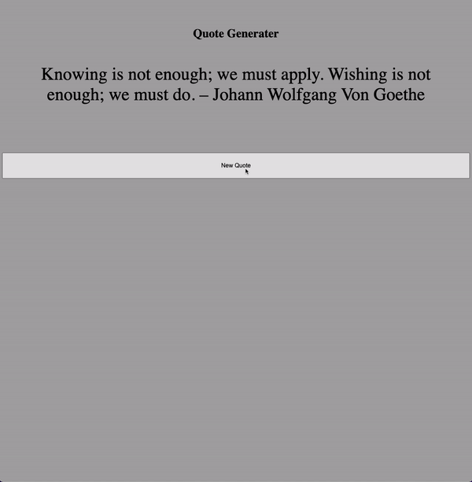

### Generate Random Quote

> JavaScript Math.floor(Math.random()) app.

## Live Demo

Preview: https://pirci.github.io/generate-quotes/

## What I Learned:

- Implement **Math.random()** method.
- Using **Math.floor()** method.
- Basic HTML and CSS structure & style.

## Possible Improvements

> Any type of suggestions/improvements to this repo are always welcome.
